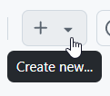
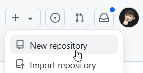
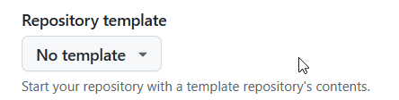
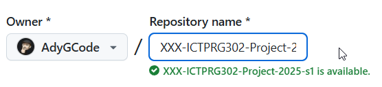
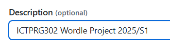
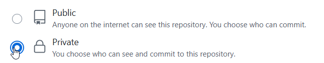
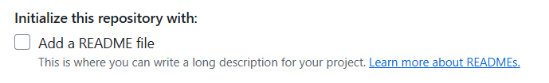
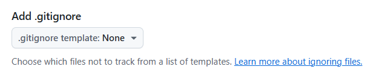
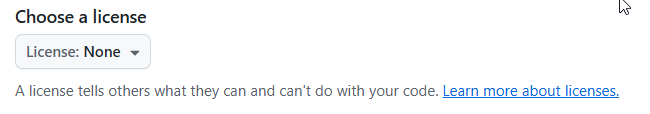
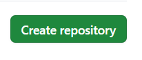

# ICTPRG302 AT2 Project

- Author:     YOUR_NAME
- Started:    2025-03-28
- Finished:   ---

## About this project

> Students TODO: Delete this TODO, and replace it with a brief description of 
> the project.

## Setting Up

Create a `Source/Repos` folder if you do not have one and then change into the 
`Source/Repos` folder.

```shell
cd ~
mkdir -p Source/Repos
cd Source/Repos
```

> **🛑 Important:**
>
> When working in Room 3-06 at TAFE, we need to use:
>
> ```shell
> cd /c/Users/YOUR_USER_NAME
> mkdir -p Source/Repos
> cd Source/Repos
> ```
>
> Remember to replace YOUR_USER_NAME with the username you logged into the
> PC with.

### Clone the Base Repo

Clone the Base Project Repository, replacing the `XXX` with **YOUR** initials.

```shell
git clone https://github.com/AdyGCode/AJG-ICTPRG302-Project-2025-s1.git XXX-ICTPRG302-Project-2025-s1
```

### Move into the Repo, and Activate Python Virtual Environment

Change into the new folder, add & activate Python virtual environment:

```shell
cd XXX-ICTPRG302-Project-2025-s1
python -m venv .venv
source .venv/Scripts/activate
```

> ### Note:
> Mac and Linux users will need to use `source .venv/bin/activate` instead
> of `source .venv/Scripts/activate` for Windows users.

### Create Empty GitHub Repo

Create your EMPTY repository on GitHub:

- Open http://github.com.
- Log into your GitHub account.
- On your Account dashboard, locate and click on the <kbd>+</kbd>.



- Select/Click New Repository.



- In the next page make sure that you select NO TEMPLATE.



- Give the repository a suitable name, for example:  
  `XXX-ICTPRG302-Project-2025-s1`, replacing `XXX` with your initials,
  `ICTPRG302` with the cluster/unit, `2025` with the current year and `S1` with
  the current semester.



- Provide a short description of the repository for future reference.

- 

- Make the repository **PRIVATE**



- Ensure the _Add a README file_ is **NOT** selected



- Ensure the _Add a .gitignore_ file is **NOT** selected



- Ensure the _Choose a License_ file is **NOT** selected



- Click on Create repository



### Change the Origin to your Repo

to change the Remote to your empty GitHub repository...

First remove the current remote (Adrian's repository):

```shell
git remote remove origin
```

Next add your new GitHub repository:

```shell
git remote add origin https://github.com/YOUR_GITHUB_ACCOUNT/XXX-ICTPRG302-Project-2025-S1
```

Remember to replace `XXX` with your initials, `ICTPRG302` with the
cluster/unit, `2025` with the current year and `S1` with the current semester.

### Upload the Current Code

Push the base code to your remote...

```shell
git push --set-upstream origin main  
```

After any changed have been committed you then may use `git push` to push
to the remote.

## Running the Application

To execute the program on the command line use:

```shell
python PYTHON_FILENAME.py
```

> ### Students TODO
>
> Replace the `PYTHON_FILENAME` with the name of your python
> then delete this TODO.


---

## JetBrains PyCharm Hints

- Use the `.ignore` plugin to help add commonly ignored files in version control
- Make the default folder a `Source/Repos` folder

### Installing the _.ignore_ Plugin

- Open PyCharm
- Press <kbd>CTRL</kbd>+<kbd>ALT</kbd>+<kbd>S</kbd> (PC)<br>
  or <kbd>CTRL</kbd>+<kbd>,</kbd> (MacOS) to open settings
- Click on Plugins option
- Click on Marketplace
- Locate **.ignore** in list, and click install
- Click OK to save the settings

You may have to restart the IDE at this point.

### Create a root .gitignore file

- Click on the project name in Pycharm
- Right mouse click the project name
- Select New...
- Select **.ignore** File (bottom of menu)
- Select & Click on **.gitignore** (top of menu)
- Tick the following options to add to the `.gitignore` file
    - [x] Backup
    - [x] Csharp
    - [x] Linux
    - [x] MicrosoftOffice
    - [x] OSX
    - [x] MacOS
    - [x] Python
    - [x] VirtualEnv
    - [x] VisualStudioCode
    - [x] Windows
- Tick "Generate without duplicates"
- Click Generate

### Allow Zoom of Editor

- Open PyCharm
- Press <kbd>CTRL</kbd>+<kbd>ALT</kbd>+<kbd>S</kbd> (PC)<br>
  or <kbd>CTRL</kbd>+<kbd>,</kbd> (MacOS) to open settings
- Click on `>` next to Editor
- Click on General
- Tick "Change font size with CTRL+Mouse Wheel"
- Optionally select "All Editors"
- Click OK to save the settings

You will now be able to <kbd>CTRL</kbd>+Mouse Wheel to change editor font
sizes.


